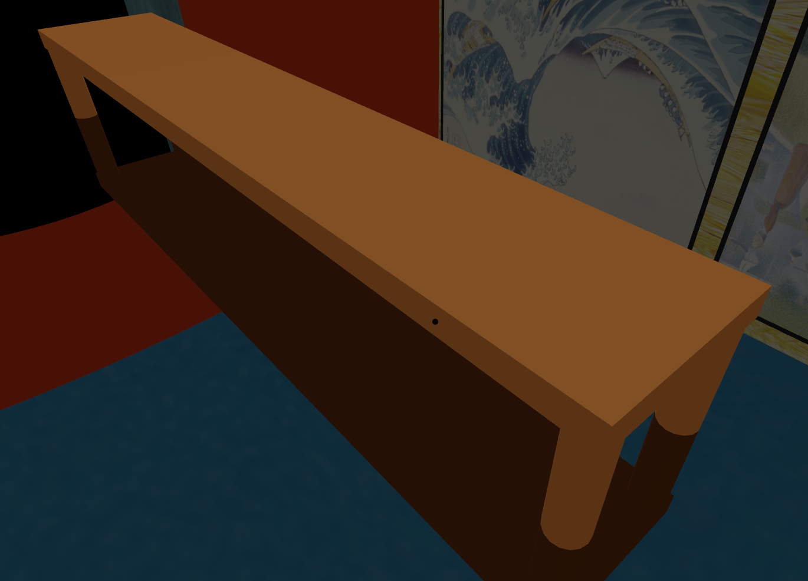

*因为学校大作业是基于ThreeJS设计和实现一个东西，就想到做一个画廊，写着写着就想解耦出来写了，就成了现在又有Shit Mountain Code，还有比较好看的代码了*

---

## 安装:
随便选择一个自己喜欢的方式克隆就好了😉

## 启动
```bash
# cd进入项目文件夹
cd ./Gallery-main

# 使用npm安装相关模块
npm install

# 然后就可以直接运行了
npm run dev

# 或者你更喜欢yarn
yarn
yarn dev
```

## 预览


## 客制化
（写了一些建造的类，但没写报错，先凑合着用吧😜）
- ### 自定义长凳大小和颜色
在benchAdd.js中定义，可以看看了解一下要传的参数。  
#### be like：
```javascript
// 在main.js中添加，导一下包(如果没有)
import Bench from "./AddElement/benchAdd"

const bench = new Bench(10 , 0).createBench(0x8b4513)
scene.add(bench)
```
#### 效果：


- ### 自定义唱片
在recordAdd.js中定义，大家都有自己喜欢的音乐，为什么不在欣赏画作的来上一首呢。
```javascript
import Record from "./AddElement/recordAdd"

// 创建唱片模型
const recordRadius = 0.8; // 唱片半径
const recordHeight = 0.05; // 唱片厚度
const recordImgSrc = './public/one_last_kiss.jpg'

const record = new Record(recordRadius, recordHeight, recordImgSrc)
// 内置添加到场景中了
const recordMesh = record.add(scene, galleryLength, galleryWidth, wallHeight)

// 预加载音频
const musicUrl = './public/OneLastKiss.flac'
const music = record.setAudio(musicUrl)

// 播放音乐
record.audioPlay(music)
```
唱片旋转的功能忘记写到类里去了(可能当时没想这么多)......

- ### 自定义墙
在wallAdd.js中定义，有两种墙，其实createCurvedWall()也可以做一个长方体的墙出来，调一下传参就行了(我没试过)。
```javascript
import Wall from "./AddElement/wallAdd";

// 墙数据
const WallSize = {
    'length': galleryLength - 0.2,
    'height': wallHeight,
}

const WallMaterial = {
    'map': './public/wall.png'
}

const WallPosition = {
    'x': 0,
    'y': wallHeight / 2,
    'z': galleryWidth / 2,
}

// 创建墙(没有厚度)
const Wall = new Wall(WallSize, WallPosition, WallMaterial)
scene.add(Wall.createWall())
```
```javascript
import Wall from "./AddElement/wallAdd";

// 墙数据
const WallSize = {
    'length': galleryWidth,
    'height': wallHeight,
}

const WallMaterial = {
    'color': 0xff3c00,
}

const WallPosition ={
    'x': galleryLength / 2,
    'y': 0,
    'z': 0,
}

const doorWidth = 7.5;
const doorTotalHeight = 7;

const dic = {'isDoor': true, 'doorWidth': doorWidth, 'doorTotalHeight': doorTotalHeight}

// 创建墙（有厚度，带门洞）
const Wall = new Wall(WallSize, WallPosition, WallMaterial, dic).createCurvedWall()
scene.add(Wall)

```
本来想引个物理引擎做个空气墙的，尝试了一下失败了，后续再用Three补吧。

- ### 自定义画
这个是一开始准备解耦的时候写的，写的太烂了就不展示了，有兴趣可以去painting里看看。

- ### 其他
里面还有元素没解耦出来，解耦出来的还有好多坑没填，写的好累，最近还好忙啊......