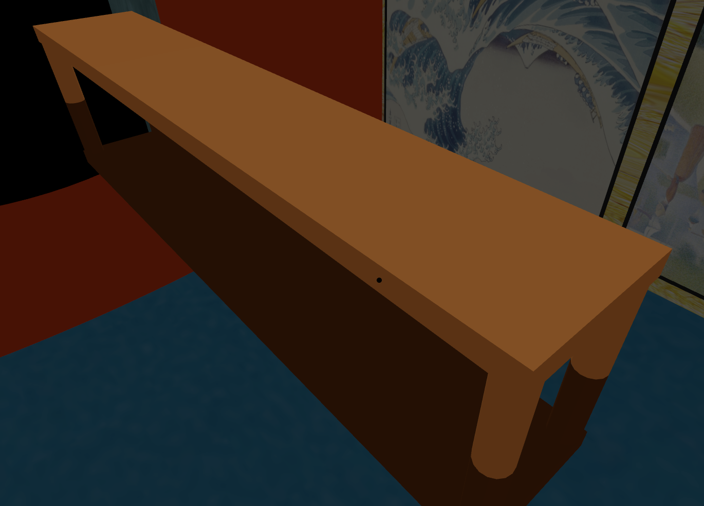
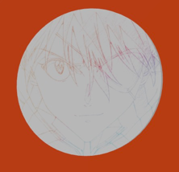

*因为学校大作业是基于ThreeJS设计和实现一个东西，就想到做一个画廊，写着写着就想解耦出来写了，就成了现在又有Shit Mountain Code，还有比较好看的代码了*

---

## 安装:
随便选择一个自己喜欢的方式克隆就好了😉

## 启动
```bash
# cd进入项目文件夹
cd ./Gallery-main

# 使用npm安装相关模块
npm install

# 然后就可以直接运行了
npm run dev

# 或者你更喜欢yarn
yarn
yarn dev
```

## 预览


## 客制化
（写了一些建造的类，但没写报错，先凑合着用吧😜）
- ### 自定义长凳大小和颜色
在benchAdd.js中定义，可以看看了解一下要传的参数。  
#### be like：
```javascript
// 在main.js中添加，导一下包(如果没有)
import Bench from "./AddElement/benchAdd"

const bench = new Bench(10 , 0).createBench(0x8b4513)
scene.add(bench)
```
#### 效果：


- ### 自定义唱片
在recordAdd.js中定义，大家都有自己喜欢的音乐，为什么不在欣赏画作的来上一首呢。

#### 效果：
  
可能和画框一样加一个边框会更像唱片一点，或者直接ps一个唱片图片上去，但目前就先这样吧。毕竟👇  
唱片旋转的功能忘记写到类里去了(可能当时没想这么多)......

- ### 自定义墙
在wallAdd.js中定义，有两种墙，其实createCurvedWall()也可以做一个长方体的墙出来，调一下传参就行了(我没试过)。

本来想引个物理引擎做个空气墙的，尝试了一下失败了，后续再用Three补吧。

- ### 自定义画
新的在newPaintingAdd.js中，这次的和其他的一样自定义大小和位置了，并且能自定义旋转方向了，更方便挂在不同角度的墙上了(其实原来的没这个功能)。

目前没想道一次性添加多个画作的好方法，原来的没删了，但文件没删。

- ### 其他
里面还有元素没解耦出来，解耦出来的还有好多坑没填，写的好累......
